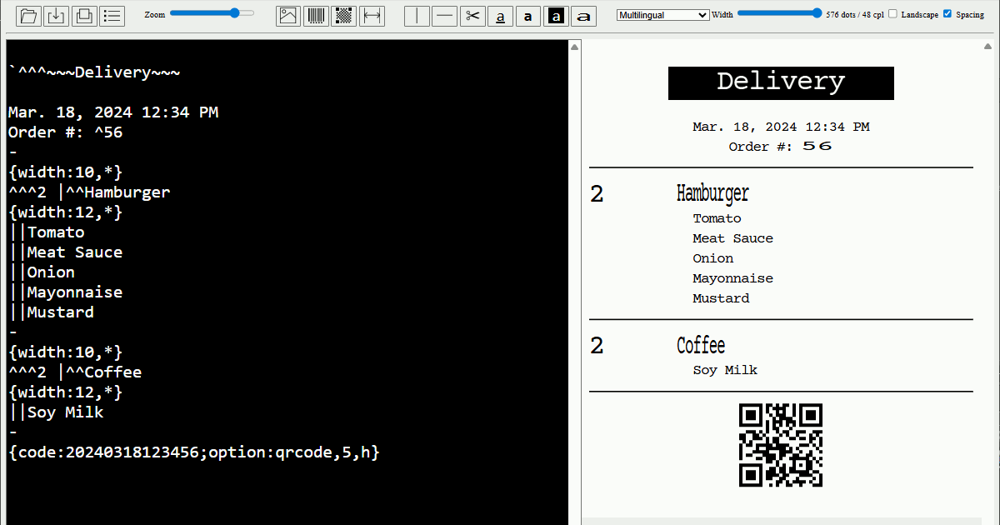
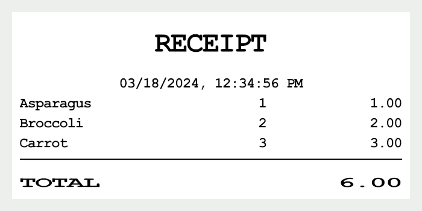
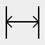
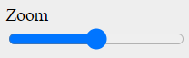
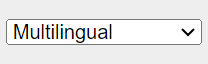
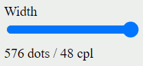
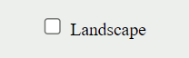

# Receipt.js Designer

A development tool to edit, preview, and print the receipt markdown.  
https://receiptline.github.io/receiptjs-designer/  

  


# Editor and viewer

Main area for editing a receipt markdown file.  
This preview is displayed side by side.  

```
^^^RECEIPT

03/18/2024, 12:34:56 PM
Asparagus | 1| 1.00
Broccoli  | 2| 2.00
Carrot    | 3| 3.00
---
^TOTAL | ^6.00
```

  


# Menu bar

## File

|Control|Description|
|---|---|
||Open receipt markdown (\*.receipt, \*.txt)|
||Download receipt markdown (\*.receipt), plain text (\*.txt), SVG image (\*.svg), or PNG image (\*.png)|
||Print receipt markdown|
||Set print options|

## Insert

|Control|Description|
|---|---|
||Insert image<br>`{image:...}`|
||Insert barcode<br>`{code:...; option:...}`|
||Insert 2D code<br>`{code:...; option:...}`|
||Insert formatting<br>`{width:...; border:...; text:...; align:...}`|

## Edit

|Control|Description|
|---|---|
||Add Column delimiter<br> <code>&#x7c;</code>|
||Add horizontal rule<br>`-`|
||Add paper cut<br>`=`|
||Underline text<br>`_`|
||Emphasize text<br>`"`|
||Invert text<br>`` ` ``|
||Enlarge text<br>`^`|

## View

|Control|Description|
|---|---|
||Zoom in/out|
||Select language|
||Change print width (cpl: characters per line)|
||Enable/Disable landscape orientation|
||Enable/Disable line spacing|


# Web browsers

The print function is available on Chrome, Edge, and Opera that support the Web Serial API.  
(Windows, Linux, macOS, ChromeOS, and **Android**)  


# Receipt printers

- Epson TM series
- Seiko Instruments RP series
- Star MC series
- Citizen CT series
- Fujitsu FP series

Connect with the Web Serial API.  
(Bluetooth, virtual serial port, and serial port)  

Epson TM series (South Asia model) and Star MC series (StarPRNT model) can print with device font of Thai characters.  

## Restrictions

The Web Serial API has no write timeout, so if hardware flow control is enabled, opening the printer cover during printing may cause the browser to stop responding. In this case, close the printer cover or press the paper feed button. Alternatively, change the printer's busy condition setting from "Offline or receive buffer full" to "Receive buffer full".  

_The restriction on Epson TM Virtual Port on Windows that existed in previous versions has been resolved. There is no need to change the signal line settings._  
