# Receipt.js Designer

A development tool to edit, preview, and print the receipt markdown.  
https://receiptline.github.io/receiptjs-designer/  

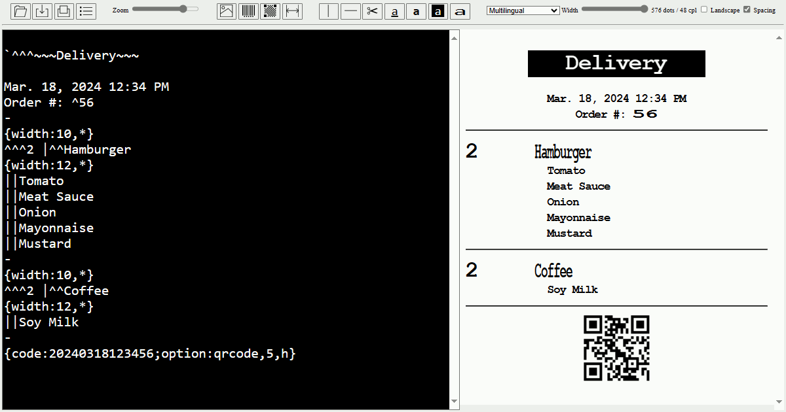  


# Editor and viewer

Main area for editing a receipt markdown file.  
This preview is displayed side by side.  

```
^^^RECEIPT

03/18/2024, 12:34:56 PM
Asparagus | 1| 1.00
Broccoli  | 2| 2.00
Carrot    | 3| 3.00
---
^TOTAL | ^6.00
```

  


# Menu bar

## File

|Control|Description|
|---|---|
|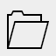|Open receipt markdown (\*.receipt, \*.txt)|
|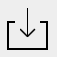|Download receipt markdown (\*.receipt), plain text (\*.txt), SVG image (\*.svg), or PNG image (\*.png)|
||Print receipt markdown|
|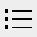|Set print options|

## Insert

|Control|Description|
|---|---|
|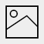|Insert image<br>`{image:...}`|
||Insert barcode<br>`{code:...; option:...}`|
||Insert 2D code<br>`{code:...; option:...}`|
||Insert formatting<br>`{width:...; border:...; text:...; align:...}`|

## Edit

|Control|Description|
|---|---|
|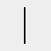|Add Column delimiter<br> <code>&#x7c;</code>|
|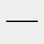|Add horizontal rule<br>`-`|
|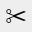|Add paper cut<br>`=`|
|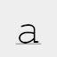|Underline text<br>`_`|
|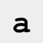|Emphasize text<br>`"`|
||Invert text<br>`` ` ``|
|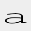|Enlarge text<br>`^`|

## View

|Control|Description|
|---|---|
||Zoom in/out|
||Select language|
||Change print width (cpl: characters per line)|
||Enable/Disable landscape orientation|
|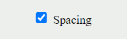|Enable/Disable line spacing|


# Web browsers

- Modern Web browsers

The print function is available on Chrome, Edge, and Opera for PCs that support the Web Serial API.  
(Windows, Linux, Mac, and ChromeOS)  


# Receipt printers

- Epson TM series
- Seiko Instruments RP series
- Star MC series
- Citizen CT series
- Fujitsu FP series

Connect with the Web Serial API.  
(Bluetooth, virtual serial port, and serial port)  

Epson TM series (South Asia model) and Star MC series (StarPRNT model) can print with device font of Thai characters.  

## Restrictions

### When connecting a USB printer with Epson TM Virtual Port on Windows

Closing the virtual port to which no printer is connected may cause the browser to stop responding.  
Please change the signal line setting to "RS-232C cross cable".  

  

If the printer goes offline during print data transmission and the virtual port is closed, the browser may stop responding.  
In this case, press the printer's paper feed button.  


# License

- Receipt.js
  - Apache License, Version 2.0
- QR Code Generator for JavaScript with UTF8 Support
  - MIT License
